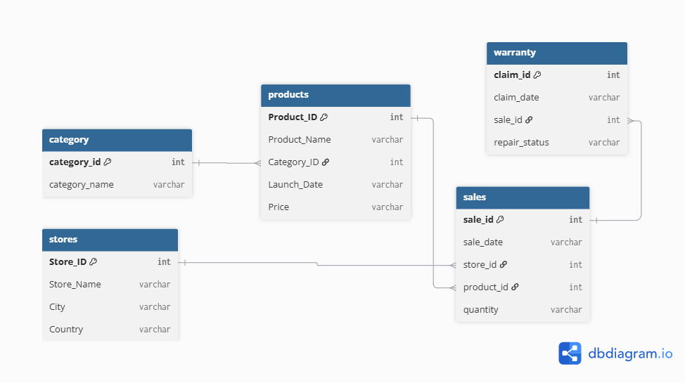
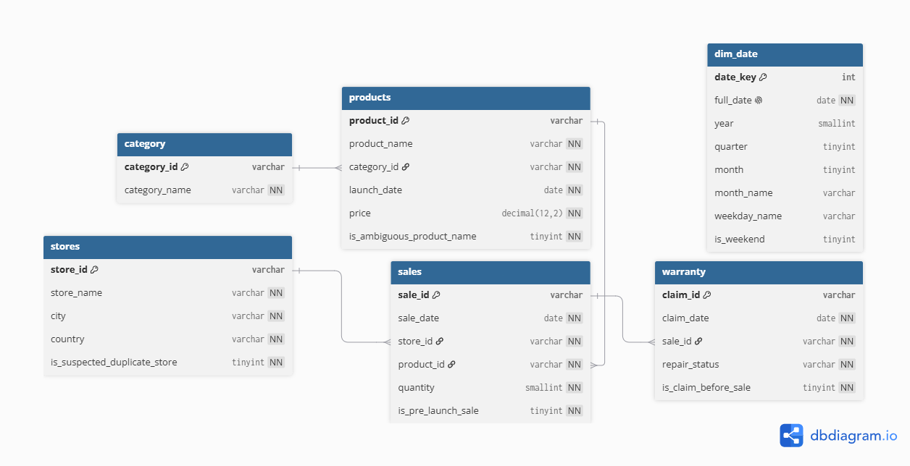

# Apple Retail Sales - Data Quality & Reconciliation Pipeline

**Contract-driven cleaning of 1,070,374 records across five retail sources - every defect audited, flagged or quarantined, revenue reconciled to $0.00 unexplained variance, and verified by four independent engines.**

## Results at a glance

| Metric | Result |
|---|---|
| Records audited | 1,070,374 across 5 tables (sales: 1,040,200) |
| Automated checks | 96 - 6 defect classes found, 90 checks clean |
| Largest defect | 493,143 sales rows (47.4%) dated before their product's launch - carrying 45.97% of $6.17B gross revenue |
| Dispositions | FIX / FLAG / QUARANTINE - 0 rows deleted, 0 unexplained |
| Reconciliation | rows = clean + quarantined +/- variance -> 0 / 0 / $0.00 |
| Engines in agreement | 4 - pandas profiler, pandas engine, MySQL audit, Power Query |
| Constraint-enforced load | 1.04M rows through PK/FK/CHECK - 0 rejections |

## Why this project

Real retail data is never tidy, and cleaning it silently is how businesses lose trust in their numbers. This project treats the source data as **untrusted**: it profiles before touching anything, encodes every cleaning decision in a versioned, machine-readable contract, dispositions every row (never deletes), and proves - with independent reconciliation - that no value appeared or vanished anywhere in the pipeline. The dataset itself is public and synthetic; **the contribution is the governance pipeline**, not novel data.

## Architecture

```
raw CSVs (5, immutable + checksums)
      |
      v
[1] ingest + profile  -----------------> reports/damage_report.html, findings.csv
      |
      v
[2] rules_contract.yaml (v1.0.0)  ------ every rule cites a finding + evidence
      |
      v
[3] cleaning engine (pandas)  ----------> data/clean/*.parquet, data/quarantine/,
      |                                   reports/cleaning_log.csv
      v
[4] reconciliation ledger  -------------> variance asserted to 0 (rows/units/revenue)
      |
      v
[5] MySQL dual schema ------------------> apple_raw (as-landed, no constraints)
      |                                   apple_clean (typed, PK/FK/CHECK)
      +--> audit scorecard: before/after, unaccounted = 0
      +--> BI star views (+ dim_date)     Power Query workbook (19 queries)
```

## Findings (what the profiler actually caught)

| # | Finding | Scale | Disposition & rationale |
|---|---|---|---|
| 1 | Sale dated before product launch (TIME-01) | 493,143 rows - 47.4% of rows, 45.97% of revenue | **FLAG & retain**: both dates individually valid; conflict is systemic. Quarantining would destroy half the fact table. BI excludes with one filter. |
| 2 | Warranty claim before its sale (TIME-02) | 2,687 - 9.0% | **FLAG & retain**: source truth unknowable from data alone; chronology signal preserved. |
| 3 | Duplicate stores - same name + city, different IDs (DUP-01) | 12 of 75 stores (6 pairs) | **FLAG, no merge**: merging would fabricate identity and silently remap sales FKs. |
| 4 | Ambiguous product name - "HomePod mini" x2 (DUP-02) | 2 SKUs (Audio $438 vs Smart Speaker $266) | **FLAG as ambiguous**: conflicting attributes imply distinct SKUs; report by ID, not name. |
| 5 | Mixed-case column names (CNF-01) | 9 columns across 2 sources | **FIX** via logged rename contract. |
| (none) | Everything else | 90 checks clean: 0 FK orphans, 0 null/duplicate PKs, all dates parse, quantity 1-10, price > 0, exactly 4 canonical repair statuses | Documented in the damage report. |

## Four engines, one truth

Every headline number was computed independently by four implementations. They agree to the cent.

| Verified metric | pandas profiler | pandas engine | MySQL audit | Power Query |
|---|---:|---:|---:|---:|
| Sales rows | 1,040,200 | 1,040,200 | 1,040,200 | 1,040,200 |
| Pre-launch flags (TIME-01) | 493,143 | 493,143 | 493,143 | 493,143 |
| Claims before sale (TIME-02) | 2,687 | 2,687 | 2,687 | 2,687 |
| Units | 5,721,344 | 5,721,344 | 5,721,344 | 5,721,344 |
| Gross revenue | 6,166,293,030 | 6,166,293,030 | 6,166,293,030 | 6,166,293,030 |
| Flagged revenue | 2,834,906,410 | 2,834,906,410 | 2,834,906,410 | 2,834,906,410 |
| FK orphans | 0 | 0 | 0 | 0 |

*Power Query values from the workbook's Reconciliation tab, Audit_FK tab, and Data Model slicer (see powerquery/recipe.md).*

## The rules contract

Cleaning logic lives in config, not code. The engine reads `docs/rules_contract.yaml`; changing a fix means editing the contract, never the engine.

```yaml
- rule_id: R-TIME-001
  check_id: TIME-01
  table: sales
  action: FLAG
  flag_column: is_pre_launch_sale
  rationale: >
    47.4% of fact rows; both dates individually valid, conflict systemic.
    Quarantining would destroy half the fact table. Flag lets BI
    include/exclude deliberately.
```

## Repository tour

```
apple-retail-sales-pipeline/
+-- data/
|   +-- raw/            # source CSVs (not committed) + checksums.md5
|   +-- clean/          # engine output (parquet)
|   +-- quarantine/     # empty - and that is a verified result, not an omission
+-- docs/
|   +-- rules_contract.yaml      # v1.0.0 - signed-off cleaning contract
|   +-- decisions.md             # D1-D21: every policy decision + rationale
|   +-- assumptions.md           # A1-A10, each CONFIRMED or VIOLATED (N rows)
|   +-- erd_before.png           # everything varchar, every relationship "assumed"
|   +-- erd_after.png            # typed, constrained, flags documented with counts
|   +-- exec_summary.md / .pdf   # 2-page management view
+-- sql/
|   +-- 01_ddl_raw.sql           # all-VARCHAR as-landed schema
|   +-- 02_ddl_clean.sql         # the contract, physically enforced by MySQL
|   +-- 03_audit_views.sql       # 13 checks x 2 schemas (unit-consistent, v1.1)
|   +-- 04_bi_model.sql          # dim_date + fact views (flags exposed)
+-- src/
|   +-- ingest.py  profile.py  clean.py  reconcile.py  db.py  load_mysql.py
+-- scripts/
|   +-- smoke_test.py  refresh_audit.py  build_bi.py
+-- reports/
|   +-- damage_report.html  findings.csv  cleaning_log.csv  clean_summary.json
|   +-- reconciliation.csv  audit_scorecard.csv  load_verification.csv  bi_sanity.csv
+-- powerquery/
    +-- recipe.md                # rerunnable recipe + verification gates
    +-- m/*.pq                   # all 19 M scripts, reviewable without Excel
    +-- Apple_Retail_PowerQuery_Recipe.xlsx   # 183MB with Data Model - kept local; rebuild from recipe.md in ~10 min
```

## How to run

```powershell
python -m venv .venv
.\.venv\Scripts\activate
pip install -r requirements.txt

# 1. Profile - writes reports/damage_report.html + findings.csv (read-only)
python -m src.profile

# 2. Clean via contract - data/clean, data/quarantine, reports/cleaning_log.csv
python -m src.clean

# 3. Independent reconciliation - non-zero variance exits non-zero (gate)
python -m src.reconcile

# 4. MySQL (8.0.16+) - local install or:
#      docker run --name mysql-apple -e MYSQL_ROOT_PASSWORD=<pw> -p 3306:3306 -d mysql:8.4
 $env:MYSQL_USER = "apple_etl"   # least-privilege pipeline account; root is admin-only
$env:MYSQL_PASSWORD = "<pw>"
python -m src.load_mysql          # DDL, load, views, verification, scorecard
python -m scripts.refresh_audit   # regenerate views + 3-way profiler crosscheck
python -m scripts.build_bi        # dim_date, BI views, tie-out vs clean parquet

# 5. Power Query workbook - build steps + gates in powerquery/recipe.md
```

## Data model

| Before | After |
|---|---|
|  |  |

Before: everything `varchar`, every relationship annotated *assumed - unvalidated*. After: typed, PK/FK/CHECK enforced, contract flags documented with row counts. The pair is the project in two images.

## Scorecard (the audit artifact)


13 checks run against both schemas. Every violation is either eliminated (0) or carried as a contract flag - `unaccounted = 0` everywhere, cross-checked against the pandas profiler.

## Key decisions (full log: docs/decisions.md)

- **D2/D3** Raw data is immutable; dispositions are FIX / FLAG / QUARANTINE - never DELETE.
- **D5** The 47.4% pre-launch population is flagged, not removed: preserving the fact table beats a clean-looking report.
- **D13** The raw schema is deliberately constraint-free - constraints are assertions of the clean contract and belong in `apple_clean`.
- **D17** A v1 audit bug compared rows vs groups; `unaccounted = 0` proved internal consistency, not correctness. Fixed with unit-consistent counts + automated three-way crosscheck. Lesson recorded.

## Limitations (stated, not hidden)

- Source is a public synthetic dataset, widely used in tutorials; the governance pipeline is the differentiator.
- Prices are static list prices - no price history exists, so revenue = quantity x current price.
- Warranty chronology (average ~800 days to claim) shows generator artifacts; flagged and exposed rather than silently corrected.
- Multi-currency not modeled (19 countries, single price column).

## What I would build next

Great Expectations or dbt tests replacing the custom check layer; Airflow orchestration; SCD2 price history for point-in-time revenue; incremental loads (the pipeline is currently full-refresh by design).

## Skills -> artifacts

| Skill | Evidence |
|---|---|
| Profiling at 1M-row scale | `src/profile.py` - 96 checks -> damage report |
| Contract-driven cleaning | `rules_contract.yaml` read by `src/clean.py` |
| Reconciliation & controls | `src/reconcile.py`, `audit_scorecard.csv`, automated crosschecks |
| SQL / MySQL 8 | Dual schema, CHECK/FK/PK, audit views, recursive-CTE `dim_date` |
| BI modeling | Star views, flags-as-filters, `dim_date` |
| Power Query / M | 19-query rerunnable workbook + recipe + gates |
| Governance & docs | 21 logged decisions, ERD before/after, exec summary |

---

**Data:** `data/raw/` is not committed (regenerable); MD5 checksums in `data/raw/checksums.md5`. Source CSVs: [https://www.kaggle.com/datasets/amangarg08/apple-retail-sales-dataset]
**Author:** [Walid_Chibi] | [https://www.upwork.com/freelancers/~0146fc161140418dd2?mp_source=share]